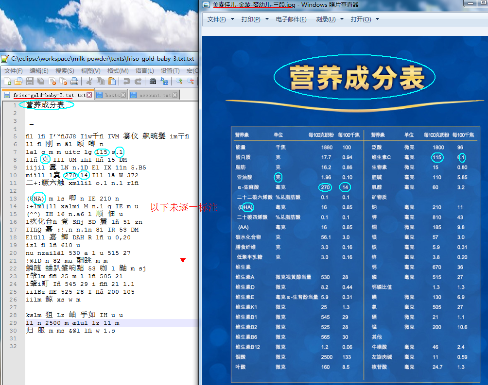
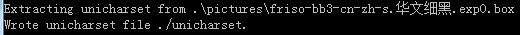

# milk-powder
构建市面奶粉数据库及导购机器人。

---
# 营养配方 #
这是本项目的难点，技术的挑战源于政府信息服务的不完善。

## 发函给监管机构申请 ##
优点：格式化的（富）文本或CSV等格式化数据，直接用于分析。

缺点：有关部门不配合度高。

## 找厂家索取 ##
优点：可能拿到最全面的信息。

缺点：联系方式公开度差、处理速度慢，亲自面谈成本高、成功率次、效率差。

## 集广告等宣传资料解析 ##
优点：公开度高、容易抓取。

缺点：大部分是图像（电子或印制），手工录入工作量大。

---
由于勾搭“监管机构”未遂、联系“厂家”没被打理，只好走最后一条路。
### 利用Tesseract-OCR提取图像中营养配方 ###

#### 环境准备 ####
这里给出“OCR Engine v3.02 with Leptonica”配置。

- Tesseract-OCR-Windows [OCR Engine v3.02 with Leptonica][0] [Others][1]
- 简体中文字库 [For-Tesseract-OCR-3.0.2][2]
- [jTessBoxEditor][3]

确保tesseract.exe添加到环境PATH变量；确保中文字库放置在Tesseract-OCR\tessdata目录下。

#### [详细步骤][7] ####
- 执行

	tesseract .\pictures\美素佳儿-金装-婴幼儿-三段.jpg .\texts\friso-gold-baby-3.txt -l chi_sim

- 用Notepad++打开生成的文本文件

	

	显然很差！看来必须训练专用的中文字库。

- 用画图板（mspaint）把图片另存为TIF格式

	TIF文件名：[lang].[font].exp[number].tif
	lang是语言、font是字体、number是测试排次，可自定义。

	经比对“美素佳儿-金装-婴幼儿-三段”中所用字体为“华文细黑10号（简体汉字）”和“Arial9号（英文字母、阿拉伯数字、希腊字母）”；然而Tesseract-OCR并不支持“STXIHEI（即华文细黑）”[字体][4]，只能找近似字体替代，暂时用“CHei_PRC”。因此，TIF文件名应为“chi_sim.CHei_PRC.exp0.tif”。

- 生成box文件

	tesseract .\pictures\chi_sim.CHei_PRC.exp0.jpg .\pictures\chi_sim.CHei_PRC.exp0 -l chi_sim batch.nochop makebox

	其实，这个box文件就是把所识别出的字符（且不论对错）和在图像中对应的位置列出来。

- 矫正错误

	启动jTessBoxEditor（双击目录下的train.bat）；
	打开chi_sim.CHei_PRC.exp0.tif做校订；
	把“美素佳儿-金装-婴幼儿-三段”的表名和列标题这部分更改完，以快速熟悉流程、体验效果。

- 训练样本

	tesseract .\pictures\chi_sim.CHei_PRC.exp0.jpg .\pictures\chi_sim.CHei_PRC.exp0 nobatch box.train

	

	表示修正过的仍有“2”个没能识别出来，且放着。

	unicharset_extractor .\pictures\chi_sim.CHei_PRC.exp0.box

	

	新建“[font_properties][5]”文件（[必须无BOM且换行为UNIX风格][6]）：

		CHei_PRC 0 0 0 0 0

	shapeclustering -F .\font_properties -U .\unicharset .\pictures\chi_sim.CHei_PRC.exp0.tr

	擦~烦人的报错！

		Reading .\pictures\chi_sim.CHei_PRC.exp0.tr ...
		Font id = -1/0, class id = 2/132 on sample 0
		font_id >= 0 && font_id < font_id_map_.SparseSize():Error:Assert failed:in file ..\..\classify\trainingsampleset.cpp, line 622

**百度和谷歌都没能找到可用的解决方法。**

# 引用 #
[0]: http://www.softpedia.com/get/Programming/Other-Programming-Files/Tesseract-OCR.shtml "Tesseract-OCR-Windows"
[1]: https://digi.bib.uni-mannheim.de/tesseract/ "Tesseract-OCR-Windows"
[2]: https://sourceforge.net/projects/tesseract-ocr-alt/files/tesseract-ocr-3.02.chi_sim.tar.gz "For-Tesseract-OCR-3.0.2"
[3]: http://www.softpedia.com/get/Multimedia/Graphic/Graphic-Others/jTessBoxEditor.shtml "jTessBoxEditor"
[4]: https://raw.githubusercontent.com/tesseract-ocr/langdata/master/font_properties "Fonts Supported By Tesseract-OCR"
[5]: https://github.com/tesseract-ocr/tesseract/wiki/Training-Tesseract-3.00–3.02#font_properties-new-in-301 "font properties"
[6]: https://github.com/tesseract-ocr/tesseract/wiki/Training-Tesseract-3.00–3.02#requirements-for-text-input-files "font properties"
[7]: https://github.com/tesseract-ocr/tesseract/wiki/Training-Tesseract-3.00–3.02 "手册"